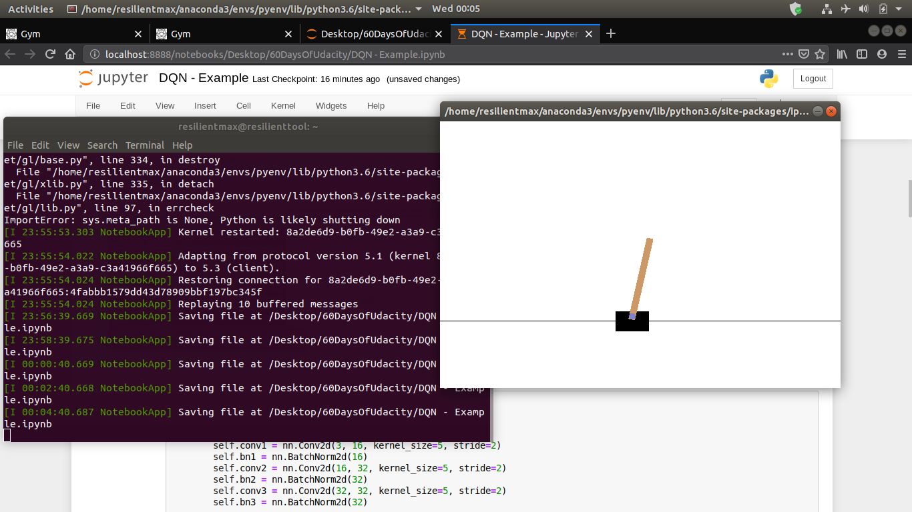

# 60DaysOfUdacity
The premise of this challenge is to build a habit of practicing new skills by making a public commitment of practicing the topics of Secure and Private AI program every day for 60 days.

___

**DAY 1:**
Hi, my name is Masood Khan Patel, I hereby pledge to participate and complete the #60daysofudacity challenge.
:heavy_check_mark:Revised Lesson 2: Deep Learning with PyTorch
:heavy_check_mark:Reviewed some previous DL projects
:heavy_check_mark:Connected with peers from earlier scholarship challenge
I encourage @Tejas Jain, @Berenice and @Naushad to participate in the challenge as well if you haven't :wink::smile: and keep posting your progress everyday!
___

**DAY 2** of #60daysofudacity :
- Learn, understand and practice code of _Lesson 3: Intro to DIfferential Privacy_ and _Lesson 4: Evaluating the Privacy of a Function_ :heavy_check_mark:
- Reading and thinking about different real world use cases of differential privacy. Some reading here... https://en.wikipedia.org/wiki/Implementations_of_differentially_private_analyses :heavy_check_mark:

I encourage @Dustin Gogoll to be part of this initiative.
Same goes for @annaSWE, I know it's overwhelming after successfully completing the Deep Learning Nanodegree, Congrats again!

Take some break or rest and then just at least 30 minutes a day can make a huge difference! :innocent:
___

**DAY 3** of #60daysofudacity :
- Studied a lot and completed the lesson _Intro to Local and Global DP_ :heavy_check_mark:
- Completed the mini projects in the same lesson :heavy_check_mark:
- Read more about global DP, types of noise, sensitivity, epsilon, delta etc :heavy_check_mark:

I encourage my friend @Saiteja Alampally and @Ana Hristian to be part of this initiate. Check out #announcements for more info on how to join #60daysofudacity.
___

**DAY 4** of #60daysofudacity :
- Lesson: _Differential Privacy for Deep Learning_ :heavy_check_mark:
- PATE Analysis mini project :heavy_check_mark:
- Started working on separate github repo for #60daysofudacity challenge. 

I encourage @Berenice and @Taimur Zahid to share their progress for the day.
___

**DAY 5** of #60daysofudacity :
- Lesson _Federated Learning_ completed :heavy_check_mark:
- Revised all the previous lessons :heavy_check_mark:
- I encourage @Sky and @Kamil to post their progress for the day
___

**DAY 6** of #60daysofudacity :
- Read first two chapters of _Algorithmic Foundations of Differential Privacy_ by Cynthia Dwork :heavy_check_mark:
- Went through PySyft codebase on github looking for ways to contribute and working on an issue :heavy_check_mark:
https://github.com/OpenMined/PySyft/issues
- I encourage @Rhythm and @thisladytechs to take part in this initiative and share their progress.
___

**DAY 7** of #60daysofudacity :
- Read more about federated learning and how it is done in real world use cases. :heavy_check_mark:
- Exploring other language bindings for PySyft like PySyft in OCaml :heavy_check_mark:
- Reading the original research by Brendan McMahan et al on federated learning. :heavy_check_mark:

I encourage @ofirbartal100 and @sabihaabc1 to share their progress for the day
___

**DAY 8** of #60daysofudacity :
- Continued reading _Algorithmic Foundations of Differential Privacy_ :heavy_check_mark:
- Refactored mini projects from the previous lessons :heavy_check_mark:
- Brendan McMahan interview in the lesson _Federated Learning_ :heavy_check_mark:

I encourage @Calincan Mircea Ioan and @Naushad  to share their progress.
___

**DAY 9** of #60daysofudacity :
I came back today from a visit to rural India and by God, I must say I feel blessed to have high speed internet. I have witnessed many many people being happy even without internet access, but still it makes me sad to see the digital divide. Really makes me sad and want to do something for those who don't have access to internet to learn and grow as a society, and stay connected!
- Finished the lesson _Securing Federated Learning_ and started working on the final project of the lesson. :heavy_check_mark:
- Updating the #60daysofudacity challenge github repo. :heavy_check_mark:
https://github.com/resilientmax/60DaysOfUdacity
- Joined the study groups of my choice and looking forward to participate in study group initiatives and collaborate. :heavy_check_mark:

I thank @Berenice a lot for encouraging me to be part of the challenge and giving me inspiration, hope to graduate to Phase 2.
___

**DAY 10** of #60daysofudacity :
- Completed until lesson 9.4 _Encrypted Deep Learning_ :heavy_check_mark:
- Working on miniproject to build an encrypted database :heavy_check_mark:
- Refactoring my behavioural cloning for self driving cars using deep learning project :heavy_check_mark:
https://github.com/resilientmax/60DaysOfUdacity
___

**DAY 11** of #60daysofudacity :
- Completed the miniproject that is part of lesson 9 _Encrypted Deep Learning_, built an encrypted database based on tensor operations that has multiple ownership and management. :heavy_check_mark:
https://github.com/resilientmax/60DaysOfUdacity
- Completed the course tutorials and learning modules, will revise them again for further understanding. :heavy_check_mark:
- Started working on encrypted deep learning on real world dataset and also brainstorming on the capstone project. :heavy_check_mark:

___

**DAY 12** of #60daysofudacity :
- Started revising all the learning modules from the beginning. :heavy_check_mark:
- Completed the mini project of lesson _Introducing Differential Privacy_ where we generate parallel databases. :heavy_check_mark:
https://github.com/resilientmax/60DaysOfUdacity
I encourage @Naushad and @Sarah Majors to share their progress of the day.
___

**DAY 13** of #60daysofudacity :
- Completed the mini project of lesson _Evaluating the Privacy of a Function_ where we check the sensitivity of a database if any one record is removed from it. :heavy_check_mark:
https://github.com/resilientmax/60DaysOfUdacity
- Studied about l1-sensitivity from the book _Algorithmic Foundations of Differential Privacy_. :heavy_check_mark:

___

**DAY 14** of #60daysofudacity :
- Completed the miniproject of the lesson 4.4 where we calculate the l1-sensitivity. :heavy_check_mark:
https://github.com/resilientmax/60DaysOfUdacity
- Learned more about `Differencing Attacks` from various sources. :heavy_check_mark:

___

**DAY 15** of #60daysofudacity :
- Watched this excellent video on differential privacy by Dr. Cynthia Dwork herself. :heavy_check_mark: 

- Working on my blockchain project where decentralization and privacy go hand in hand. I feel blockchain technology has so  much more in common with secure and privacy focused machine learning. :heavy_check_mark:
___

**DAY 16** of #60daysofudacity :
- Revised until Federated Learning. :heavy_check_mark:
___

**DAY 17** of #60daysofudacity:
- Revising Deep learning fundamentals and knowledge for applying differential privacy techniques to deep learning. :heavy_check_mark:
___

**DAY 18** of #60daysofudacity:
- I was traveling today hence I was only able to watch the interviews with distinguished engineers who are experts in federated learning.
I thank @Berenice and @Frida for encouraging me everyday, it means a lot to me.
___

**DAY 19** of #60daysofudacity:
- Applied differential privacy to MNIST dataset. :heavy_check_mark:
https://github.com/resilientmax/60DaysOfUdacity 
___

**DAY 20** of #60daysofudacity :
- Appplied federated learning on MNIST dataset. :heavy_check_mark:
https://github.com/resilientmax/60DaysOfUdacity 
___

**DAY 21** of #60daysofudacity :
- Applied federated learning on recurrent neural network. :heavy_check_mark:
https://github.com/resilientmax/60DaysOfUdacity  
___

**DAY 22** of #60daysofudacity :
- Used PyTorch to train a Deep Q Learning (DQN) agent on the CartPole task from the OpenAI gym. :heavy_check_mark:
https://github.com/resilientmax/60DaysOfUdacity

___

**DAY 23** of #60daysofudacity :
- Learning more about deep reinforcement learning and its implementations. :heavy_check_mark:
- Preparing for AWS Deepracer challenge. :heavy_check_mark:
https://github.com/resilientmax/60DaysOfUdacity
___

**DAY 24** of #60daysofudacity :
- Watched the lecture and learned a lot about Deep RL :heavy_check_mark:
")
___

**DAY 25** OF #60daysofudacity :
- Worked on the keystone project, still lot of work left :heavy_check_mark:
https://github.com/resilientmax/60DaysOfUdacity
___

**DAY 26** of #60daysofudacity :
- Refactored and uploaded my 2D particle filter project for self driving cars on to github. :heavy_check_mark:
https://github.com/resilientmax/Kidnapped-Vehicle-Project
___

**DAY 27** of #60daysofudacity :
- Programmed a path planner for self driving cars, that uses A* algorithm. :heavy_check_mark:
___

**DAY 28** of #60daysofudacity :
- Working on the keystone project, using at least 2 techniques taught in the course. :heavy_check_mark:
___

**DAY 29** of #60daysofudacity :
- Learned more about Deep Q Learning :heavy_check_mark:
- Checked out Unity-Machine Learning agents :heavy_check_mark:
___

**DAY 30** of #60daysofudacity :
- Started the Intro to Machine Learning course on Udacity for revision of basic ML. :heavy_check_mark:
- Read from Computer Vision: A Modern Approach :heavy_check_mark:
___

**DAY 31** of #60daysofudacity :
- Studied about policy based methods in Deep RL. :heavy_check_mark:
- Following the lecture... 

___

**DAY 32** of #60daysofudacity :
- Started reading Grokking Deep RL book :heavy_check_mark:
- Trained and evaluated a model for AWS DeepRacer :heavy_check_mark:
- Finished 5 lessons of DRLND :heavy_check_mark:
https://github.com/resilientmax/60DaysOfUdacity
___

**DAY 33** of #60daysofudacity :
- Revised Markov Decision Process and state machines. :heavy_check_mark:
- Wrote ROS node and related services to interact with a deep neural network. :heavy_check_mark:
- Checking ways to train AWS DeepRacer model on local machine.
https://github.com/resilientmax/60DaysOfUdacity
___