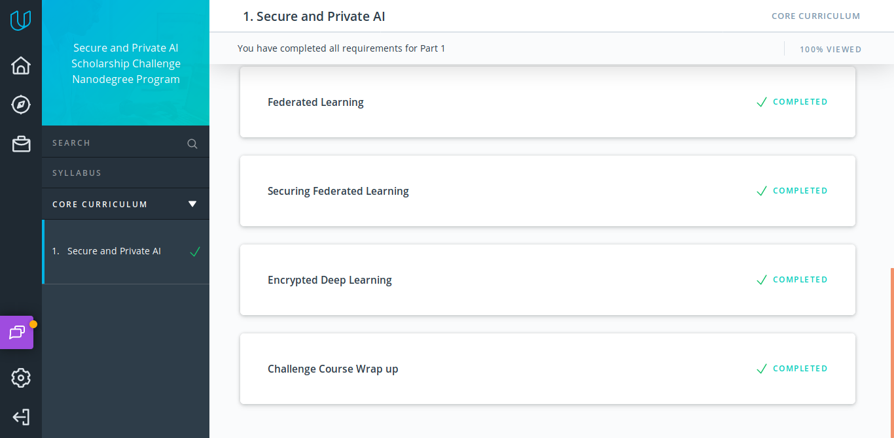
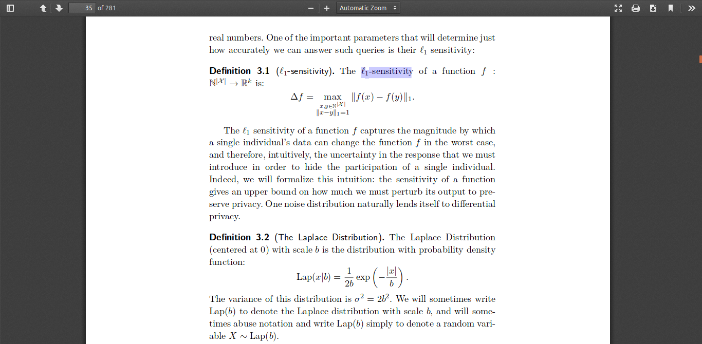

# 60DaysOfUdacity
The premise of this challenge is to build a habit of practicing new skills by making a public commitment of practicing the topics of Secure and Private AI program every day for 60 days.

___

**DAY 1:**
Hi, my name is Masood Khan Patel, I hereby pledge to participate and complete the #60daysofudacity challenge.
:heavy_check_mark:Revised Lesson 2: Deep Learning with PyTorch
:heavy_check_mark:Reviewed some previous DL projects
:heavy_check_mark:Connected with peers from earlier scholarship challenge
I encourage @Tejas Jain, @Berenice and @Naushad to participate in the challenge as well if you haven't :wink::smile: and keep posting your progress everyday!
___

**DAY 2** of #60daysofudacity :
- Learn, understand and practice code of _Lesson 3: Intro to DIfferential Privacy_ and _Lesson 4: Evaluating the Privacy of a Function_ :heavy_check_mark:
- Reading and thinking about different real world use cases of differential privacy. Some reading here... https://en.wikipedia.org/wiki/Implementations_of_differentially_private_analyses :heavy_check_mark:

I encourage @Dustin Gogoll to be part of this initiative.
Same goes for @annaSWE, I know it's overwhelming after successfully completing the Deep Learning Nanodegree, Congrats again!

Take some break or rest and then just at least 30 minutes a day can make a huge difference! :innocent:
___

**DAY 3** of #60daysofudacity :
- Studied a lot and completed the lesson _Intro to Local and Global DP_ :heavy_check_mark:
- Completed the mini projects in the same lesson :heavy_check_mark:
- Read more about global DP, types of noise, sensitivity, epsilon, delta etc :heavy_check_mark:

I encourage my friend @Saiteja Alampally and @Ana Hristian to be part of this initiate. Check out #announcements for more info on how to join #60daysofudacity.
___

**DAY 4** of #60daysofudacity :
- Lesson: _Differential Privacy for Deep Learning_ :heavy_check_mark:
- PATE Analysis mini project :heavy_check_mark:
- Started working on separate github repo for #60daysofudacity challenge. 

I encourage @Berenice and @Taimur Zahid to share their progress for the day.
___

**DAY 5** of #60daysofudacity :
- Lesson _Federated Learning_ completed :heavy_check_mark:
- Revised all the previous lessons :heavy_check_mark:
- I encourage @Sky and @Kamil to post their progress for the day
___

**DAY 6** of #60daysofudacity :
- Read first two chapters of _Algorithmic Foundations of Differential Privacy_ by Cynthia Dwork :heavy_check_mark:
- Went through PySyft codebase on github looking for ways to contribute and working on an issue :heavy_check_mark:
https://github.com/OpenMined/PySyft/issues
- I encourage @Rhythm and @thisladytechs to take part in this initiative and share their progress.
___

**DAY 7** of #60daysofudacity :
- Read more about federated learning and how it is done in real world use cases. :heavy_check_mark:
- Exploring other language bindings for PySyft like PySyft in OCaml :heavy_check_mark:
- Reading the original research by Brendan McMahan et al on federated learning. :heavy_check_mark:

I encourage @ofirbartal100 and @sabihaabc1 to share their progress for the day
___

**DAY 8** of #60daysofudacity :
- Continued reading _Algorithmic Foundations of Differential Privacy_ :heavy_check_mark:
- Refactored mini projects from the previous lessons :heavy_check_mark:
- Brendan McMahan interview in the lesson _Federated Learning_ :heavy_check_mark:

I encourage @Calincan Mircea Ioan and @Naushad  to share their progress.
___

**DAY 9** of #60daysofudacity :
I came back today from a visit to rural India and by God, I must say I feel blessed to have high speed internet. I have witnessed many many people being happy even without internet access, but still it makes me sad to see the digital divide. Really makes me sad and want to do something for those who don't have access to internet to learn and grow as a society, and stay connected!
- Finished the lesson _Securing Federated Learning_ and started working on the final project of the lesson. :heavy_check_mark:
- Updating the #60daysofudacity challenge github repo. :heavy_check_mark:
https://github.com/resilientmax/60DaysOfUdacity
- Joined the study groups of my choice and looking forward to participate in study group initiatives and collaborate. :heavy_check_mark:

I thank @Berenice a lot for encouraging me to be part of the challenge and giving me inspiration, hope to graduate to Phase 2.
___

**DAY 10** of #60daysofudacity :
- Completed until lesson 9.4 _Encrypted Deep Learning_ :heavy_check_mark:
- Working on miniproject to build an encrypted database :heavy_check_mark:
- Refactoring my behavioural cloning for self driving cars using deep learning project :heavy_check_mark:
https://github.com/resilientmax/60DaysOfUdacity
___

**DAY 11** of #60daysofudacity :
- Completed the miniproject that is part of lesson 9 _Encrypted Deep Learning_, built an encrypted database based on tensor operations that has multiple ownership and management. :heavy_check_mark:
https://github.com/resilientmax/60DaysOfUdacity
- Completed the course tutorials and learning modules, will revise them again for further understanding. :heavy_check_mark:
- Started working on encrypted deep learning on real world dataset and also brainstorming on the capstone project. :heavy_check_mark:

___

**DAY 12** of #60daysofudacity :
- Started revising all the learning modules from the beginning. :heavy_check_mark:
- Completed the mini project of lesson _Introducing Differential Privacy_ where we generate parallel databases. :heavy_check_mark:
https://github.com/resilientmax/60DaysOfUdacity
I encourage @Naushad and @Sarah Majors to share their progress of the day.
___

**DAY 13** of #60daysofudacity :
- Completed the mini project of lesson _Evaluating the Privacy of a Function_ where we check the sensitivity of a database if any one record is removed from it. :heavy_check_mark:
https://github.com/resilientmax/60DaysOfUdacity
- Studied about l1-sensitivity from the book _Algorithmic Foundations of Differential Privacy_. :heavy_check_mark:

___